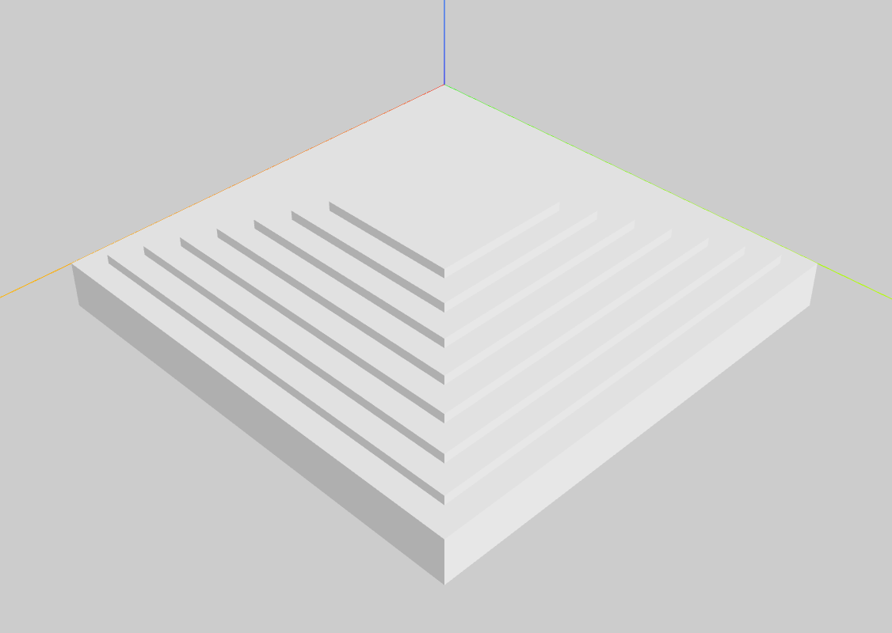

# terrain-urdf-marker

## description

Pyramid and Cell terrain maker

- generate urdf tools
- define terrain obstacles with primitive shapes

## setup

```shell
git clone https://github.com/Oya-Tomo/terrain-urdf-marker.git
cd terrain-urdf-marker
uv sync
```

## usage

### maker

```shell
uv run src/pyramid.py
```

```shell
uv run src/cell.py
```

### viewer

```shell
uv run src/view.py --path [terrain/urdf/path.urdf]
```

## sample

### pyramid terrain



### cell terrain


